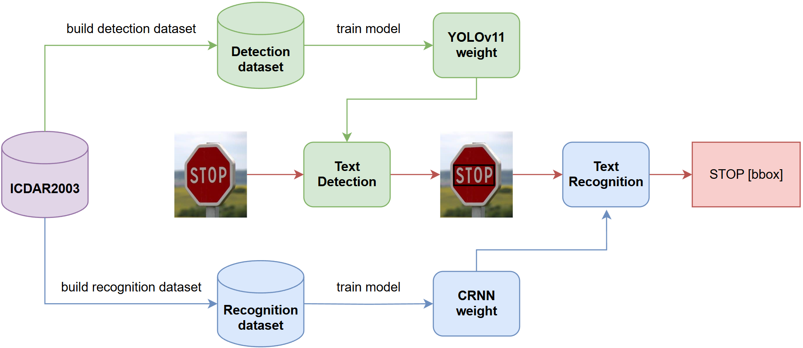

# Scene Text Recognition (STR) – End-to-End OCR System

## 📌 Project Overview

This repository implements a production-oriented **Scene Text Recognition (STR) system** for detecting and recognizing text in natural scene images.

The system is designed as an **end-to-end OCR pipeline**, combining deep learning-based text detection and recognition models into a unified architecture suitable for real-world image processing, automation, and document understanding use cases.

---

## 🧠 System Design Overview

The system follows a modular OCR architecture:

### 🔹 1. Text Detection Layer
- Model: **YOLOv11m**
- Purpose: Detect text regions in natural images
- Output: Bounding boxes + confidence scores

### 🔹 2. Text Recognition Layer
- Model: **CRNN (Convolutional Recurrent Neural Network)**
- Backbone: **ResNet34**
- Loss Function: **CTC Loss**
- Purpose: Convert cropped text regions into structured text sequences

### 🔹 3. End-to-End OCR Pipeline
- Combines detection + recognition into a single workflow
- Processes raw images → structured text output
- Supports batch and real-time inference

---



## 🚀 Deployment Architecture

The system is deployed using a multi-layer service architecture:

### 🔹 UI Layer
- Streamlit-based web interface
- Interactive image upload and inference visualization

### 🔹 API Layer
- FastAPI service for OCR inference
- Handles model requests and preprocessing

### 🔹 Inference Layer
- Ray Serve for distributed and scalable model execution
- Optimized for GPU-based inference

---

## 🚀 Key Features

- End-to-end OCR pipeline (Detection → Recognition → Output)
- YOLOv11m-based text detection
- CRNN + ResNet34-based sequence recognition
- CTC-based decoding for variable-length text
- Scalable deployment using FastAPI + Ray Serve
- Interactive UI with Streamlit
- GPU-optimized training and inference (NVIDIA T4)
- Modular design for easy extension and integration

---


## 📂 Project Structure

```bash
Scene-Text-Recognition/
│── .streamlit/                # Streamlit configuration files
│── deployment/
│   ├── app.py                 # Streamlit web application
│   ├── crnn.py                # CRNN model implementation
│   ├── object_detection.py    # FastAPI service for text detection (YOLOv11m)
│   ├── ocr.py                 # FastAPI service for full OCR pipeline
│   ├── Makefile               # Deployment configurations for Ray Serve
│── weights/                   # Pretrained weights (YOLOv11m and CRNN)
│── phase1_detection.ipynb     # Notebook for training text detection
│── phase2_recognition.ipynb   # Notebook for training text recognition
│── phase3_full.ipynb          # Notebook integrating the full pipeline
│── requirements.txt           # Dependencies and libraries
│── LICENSE
│── README.md                  # Project documentation
# P          R      mAP50 (1)
# 0.881      0.905      0.925 (train)
# 0.881      0.905      0.925 (val)
```

# Install PyTorch (GPU support optional)
conda install pytorch==2.5.1 torchvision==0.20.1 torchaudio==2.5.1 pytorch-cuda=12.4 -c pytorch -c nvidia

# Install project dependencies
pip install -r requirements.txt

⚠️ **Directly accessing the provided URL will not work** because the backend server must be running locally.

**Install dependencies**:
```bash
# Install PyTorch (Optional: GPU Support)
# https://pytorch.org/get-started/previous-versions/
conda install pytorch==2.5.1 torchvision==0.20.1 torchaudio==2.5.1 pytorch-cuda=12.4 -c pytorch -c nvidia

# Install dependencies
pip install -r requirements.txt
```

**Deploy app**:

```bash
# Note: If your device doesn't have `make` command, you can use Git Bash instead

# Initialize the environment
cd deployment
make init

# Start OCR service (Ray + FastAPI)
cd deployment
make deploy_ocr

# Launch Streamlit app for UI-based inference
cd deployment
make streamlit
```


## 📜 License
This project is licensed under the MIT License – feel free to modify and distribute it as needed.

## 🤝 Acknowledgments

This project was assigned by the AIO course from [AI VIET NAM](https://www.facebook.com/aivietnam.edu.vn) and completed by me as a participant of the course.

If you find this project useful, consider ⭐️ starring the repository or contributing to further improvements!
